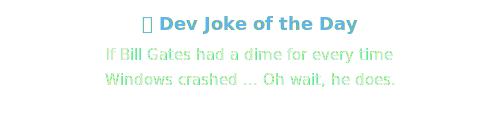

  

   
  
   

---

### 👨‍💻 About Me
*I am a 1st-year Computer Science student deeply focused on Cloud-Native architectures and serverless workflows.*
- 🔭 **Core Focus:** AWS Architecture, Linux, and Python System Design.
- 💡 **Philosophy:** Learning in public and tracking progress every single day.
- 📫 **Connect:** [LinkedIn](https://www.linkedin.com/in/kevin-josh10)

   
  <h3>🚀 The 1000-Day Mission</h3>
  
<i>I am currently on a public, 1000-day journey to master Cloud Infrastructure, AWS Architecture, and Backend System Design. This is a daily commitment to building production-grade systems and bridging the gap between theory and real-world engineering.</i>

  
   

---

### 🛠️ `kevin@aws:~$ ls /usr/local/skills`

  

---

### 📂 Featured Architecture & Engineering Projects

| Project | Description | Key Tech |
|---------|-------------|----------|
| **[Production-Grade S3 Backup Tool](https://github.com/kevinjosh10/s3-backup-tool)** | A resilient, industry-standard CLI utility for metadata-based incremental synchronization, AWS encryption, and lifecycle automation. | `Python`, `AWS S3`, `Boto3` |
| **[CloudMorph Serverless](https://github.com/kevinjosh10/CloudMorph)** | A serverless file intelligence platform deployed on AWS. Handles secure cross-origin uploads and pre-signed URL generation via Lambda. | `AWS Lambda`, `API Gateway` |
| **[Cryptexa & JCE Hub](https://github.com/kevinjosh10/Cryptexa)** | Modular, full-stack community platforms built with modern web architecture, featuring decoupled frontend/backend services. | `Web Arch`, `Serverless` |
| **[EMG Sensor Firmware](https://github.com/kevinjosh10/emg-sensor)** | End-to-end IoT architecture bridging embedded firmware with modular backend telemetry routing and a monitoring dashboard. | `IoT`, `Hardware Arch` |

---

### 📊 Engineering Metrics

  
  

---

### 🐍 The Code Journey (Automated Contribution Snake)

  <picture>
    <source media="(prefers-color-scheme: dark)" srcset="https://raw.githubusercontent.com/kevinjosh10/kevinjosh10/main/assets/github-contribution-grid-snake-dark.svg">
    <source media="(prefers-color-scheme: light)" srcset="https://raw.githubusercontent.com/kevinjosh10/kevinjosh10/main/assets/github-contribution-grid-snake.svg">
    
  </picture>

   
  

   
  

---

  <i>"Building the future, one commit at a time."</i>

