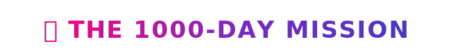
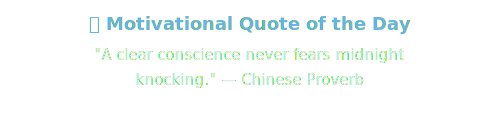
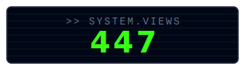

  

  

  <h2>👨‍💻 About Me</h2>
  
   
  
  
    
  <i>"Most people quit at Day 10. I chose to go 1000. That's not motivation—that's conviction."</i>

   
  
   
  
<i>A public 1000-day journey to master Cloud Infrastructure, AWS Architecture, and Backend System Design. Daily commitment to building production-grade systems—bridging the gap between theory and real-world engineering.</i>

  
   

---

### 🛠️ `kevin@aws:~$ ls /usr/local/skills`

    

---

### 📂 Featured Architecture & Engineering Projects

  

---

### 📈 Engineering Metrics

   
  

   
  

   
  

   
  

---

  <i>"Building the future, one commit at a time."</i>

